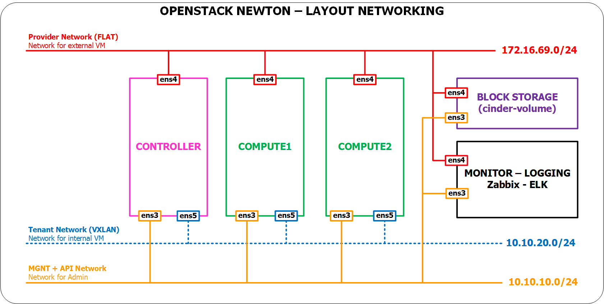

## Ghi chép về việc cài đặt OpenStack Newton

## Các bước sử dụng script cài đặt OpenStack Newton 

- Script từ phiên bản OpenStack Newton được team rút gọn các bước thực hiện.

### Mô hình cài đặt
- Tối thiểu cần 01 node Controller và 01 node Compute, các node khác có thể bổ sung theo tài nguyên có sẵn.



### Các yêu cầu thiết lập đối với phần cứng và network


### Chú ý khi lựa chọn OS và lựa chọn dải mạng

```
- OS: Ubuntu Server 16.04 64 bit. Script không hỗ trợ Ubuntu khác phiên bản này.
- CPU hỗ trở Virtualization Technology (VT)
- Đối với Ubuntu 16.04 đã chuyển sang sử dụng systemd, do vậy các lệnh có chút thay đổi, tên của các NICs sẽ thay đổi
- Trong script: 
	- ens3: sử dụng để các máy quản lý (ssh) các máy chủ cài đặt OpenStack và là network để cung cấp API.
	- ens4: sử dụng để các máy vật lý và VMs truy cập ra internet và ngược lại. Theo tài liệu của OpenStack gọi là provider network
	- ens5: Là network để các VMs truyền thông với nhau. Gọi là selfservice network
- File `config.cfg` sẽ là file chứa các biến để các script tham chiếu. Có thể thay đổi cho phù hợp nhu cầu.
```

## Các bước cài đặt

###  Cài đặt trên Controller Node

- Đăng nhập vào OS và sử dụng quyền `root`
- Update các gói phần mềm, tải git và scripts 

	```sh
	apt-get -y update && apt-get -y install git 

	git clone https://github.com/congto/OpenStack-Newton-Scripts.git

	mv /root/OpenStack-Newton-Scripts/OPS-U16/scripts/ /root/

	rm -rf  /root/OpenStack-Newton-Scripts/

	cd scripts

	chmod -R +x *.sh
	```

#### Thực thi `scripts01.sh`trên Controller 
- File `config.cfg` chứa các biến để các script tham chiếu.
- Nếu muốn thay đổi các thông tin được áp dụng trong scripts, cần chỉnh sửa file `config.cfg`. Các thông số thường thay đổi là về địa chỉ IP của các máy, tên của các NICs.
- Lưu ý: thứ tự các NIC cần đảm bảo đúng yêu cầu, vì khi thay đổi sẽ ảnh hưởng tới việc truy cập internet để tải các gói cài đặt.
- Thực hiện script `setup01.sh`, script này sẽ thiết lập IP, hostname, khai báo repos và cài đặt các gói cơ bản cho node Controller.

- Cần gõ đúng ký tự `controller`

	```sh
	bash setup01.sh controller
	```

- Sau khi thực thi xong `script01.sh`, máy chủ sẽ khởi động lại.
- Có thể ping ra internet để kiểm tra xem đã có kết nối hay chưa.

##### Thực thi `setup02.sh` trên Controller

- Đăng nhập máy controller và sử dụng quyền ssh để thực thi `setup02.sh`.
- Cần gõ đúng ký tự `controller`

	```sh
	cd /scripts
	bash setup02.sh controller
	```

- Script sẽ cài đặt các thành phần của OpenStack trên node Controller

##### Thực thi `setup03.sh` trên Controller Node

- Đăng nhập máy controller và sử dụng quyền ssh để thực thi `setup02.sh`.
- Cần gõ đúng ký tự `controller`

	```sh
	bash setup03.sh controller
	```


###  Cài đặt trên các máy chủ Compute (compute1, compute2)

- Trong hướng dẫn này chỉ thực hiện trên máy chủ `compute1`
- Cần gõ đúng tên của các máy chủ `compute1`, `compute2` ...
- Đăng nhập vào OS và sử dụng quyền `root`
- Update các gói phần mềm, tải git và scripts 

	```sh
	apt-get -y update && apt-get -y install git 

	git clone https://github.com/congto/OpenStack-Newton-Scripts.git

	mv /root/OpenStack-Newton-Scripts/OPS-U16/scripts/ /root/

	rm -rf  /root/OpenStack-Newton-Scripts/

	cd scripts

	chmod -R +x *.sh
	```

- Lưu ý: sửa file `config.cfg` tương tự như trên `controller`

####  Thực thi script  `setup01.sh` trên compute1

- Gõ lệnh dưới để thực thi script `setup01.sh`. Cần gõ đúng ký tự `compute1`

	```sh
	bash setup01.sh compute1
	```
- Sau khi thực hiện script trên xong, máy chủ sẽ khởi động lại.

#### Thực thi script`setup02.sh` trên compute1

- Đăng nhập vào máy chủ `compute1` với quyền `root` và thực hiện script tiếp theo.
- Gõ đúng ký tự `compute1`

	```sh
	cd /scripts
	bash setup02.sh compute1
	```

####  Thực hiện script `setup03.sh` trên máy chủ compute1

- Đăng nhập vào máy chủ `compute1` với quyền `root` và thực hiện script tiếp theo.
- Gõ đúng ký tự `compute1`. 

	```sh
	bash setup03.sh compute1
	```


### Thiết lập mạng, security groups, tạo vm

- Tới bước này đã có thể sử dụng OpenStack để tạo các VM.
- Script này sẽ thực hiện việc tạo network, mở các rule trong security groups, tạo router, tạo VM
- SSH vào máy chủ controller và thực hiện lệnh dưới với quyền `root`

	```sh
	cd /scripts
	bash  create-vm.sh
	```

<<<<<<< HEAD
# Hết
=======
# Hết
>>>>>>> refs/remotes/vietstacker/master
